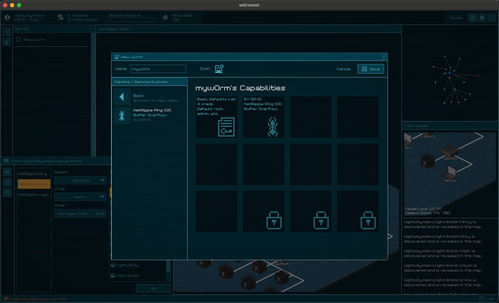
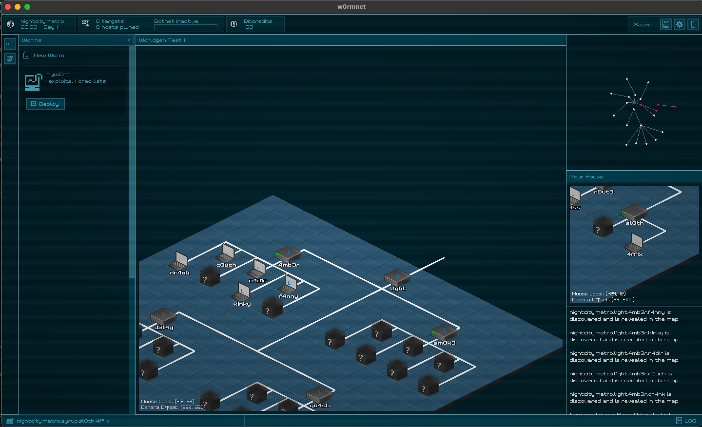

# w0rmnet

A hacking sim game built with Raylib.

Craft w0rms to unleash onto the world, build a botnet, and take over the world!

Another abandoned side-project brought to you by yours truly.

## ???

To break the monotony of my day-to-day as a web dev, I decided that I miss C enough to try to write something cool with it. That's when I discovered Raylib.

A lot of classic mistakes were made in this project. Unclear vision, the game is more about demonstrating mechanics than having fun, and I totally gave in to the temptation to overengineer with component-entity-system architecture, which in hindsight may have not been appropriate for my needs.

Regardless, I'm proud to inaugurate this to my side-project graveyard! May this inspire me to pick up game dev in the future!

